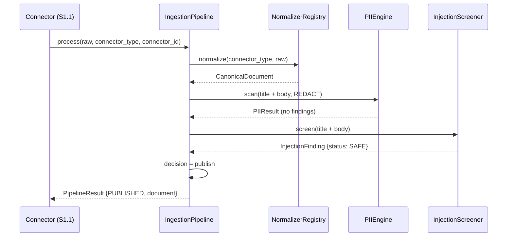
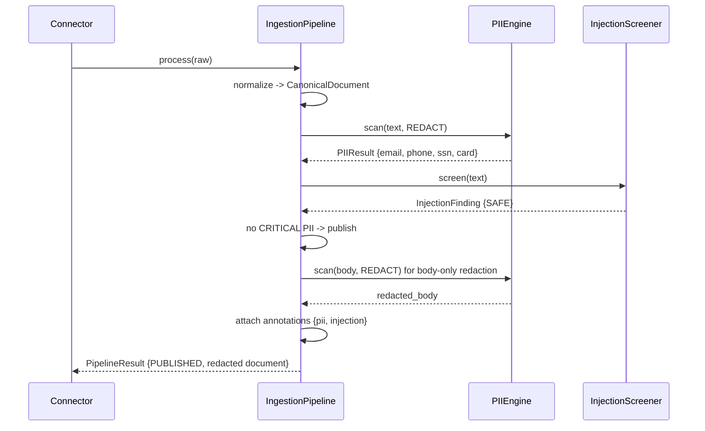
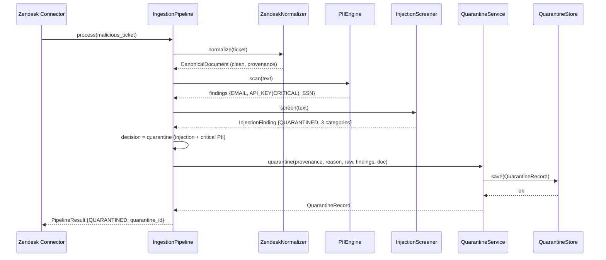
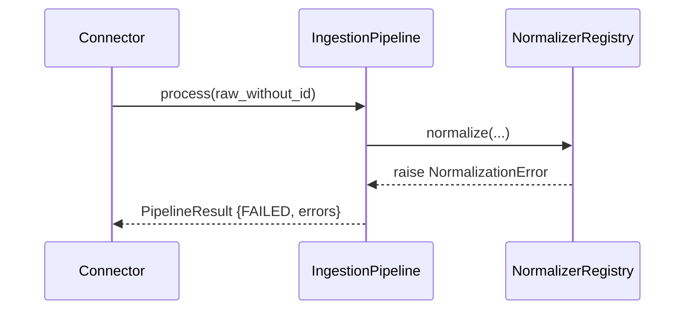

# S1.2 — Sequence Diagrams (F-09)

Wave 1 · Slice 1.2

## 1. Happy path — benign record is published

## 2. PII-only record — published with redaction

## 3. DoD demo — PII + injection record is quarantined

## 4. Normalization failure

