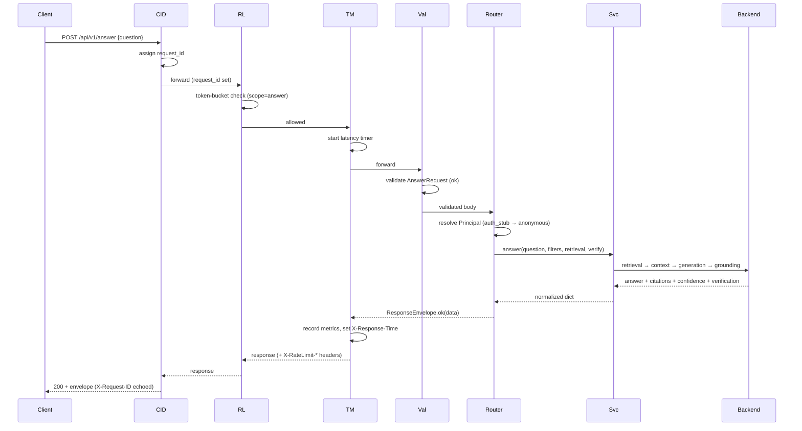
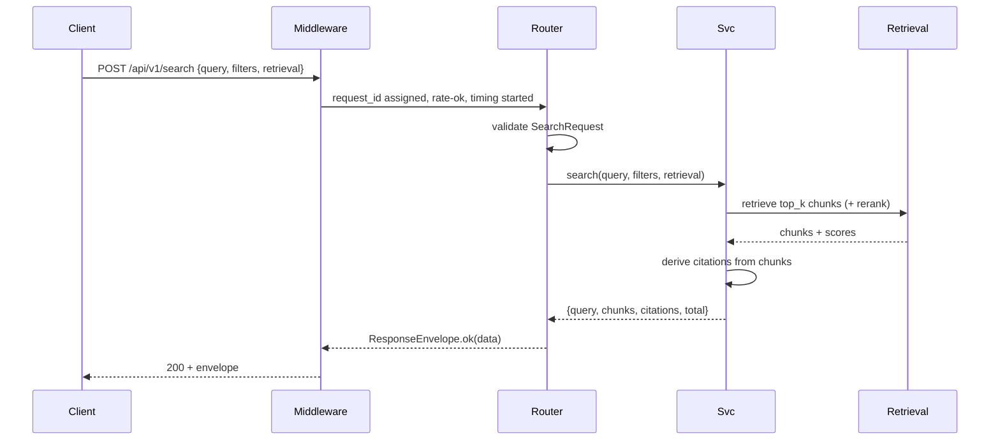
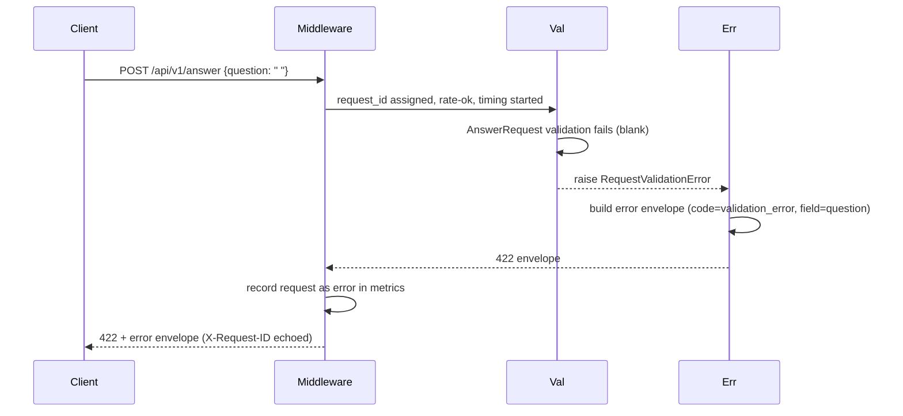
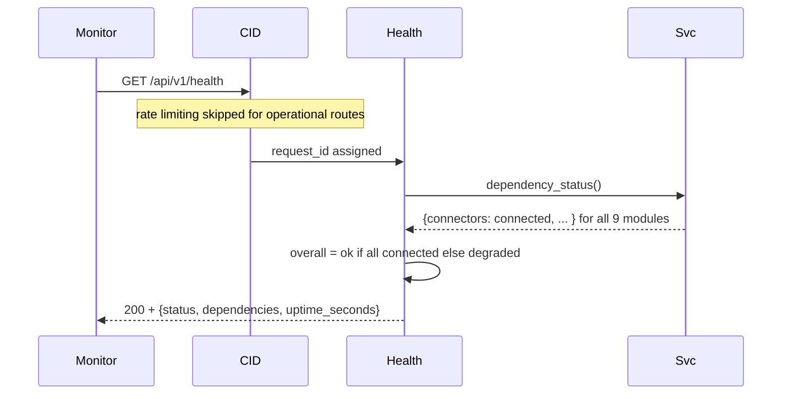

# S2.1 — Sequence Diagrams

These diagrams trace concrete requests through the API layer and into the
backend modules. They are written in Mermaid (renders on GitHub and most
Markdown viewers) and mirror the lifecycle assembled in `app.py`.

A consistent cast of participants appears across diagrams:

- **Client** — UI, partner, or external integration.
- **CID** — `CorrelationIdMiddleware`.
- **RL** — `RateLimitMiddleware`.
- **TM** — `TimingMetricsMiddleware`.
- **Val** — FastAPI validation against a request model.
- **Router** — the matching handler in `router.py`.
- **Svc** — `PMOSServices` adapter (`services.py`).
- **Backend** — one or more of the nine modules.
- **Err** — centralized handlers in `error_handlers.py`.

---

## 1. Happy path — `POST /api/v1/answer`



---

## 2. Search — `POST /api/v1/search`



---

## 3. Ingestion — `POST /api/v1/documents/ingest`

```mermaid
sequenceDiagram
    participant Client
    participant Middleware
    participant Router
    participant Svc
    participant Ingestion

    Client->>Middleware: POST /api/v1/documents/ingest {connector_id, source_uris}
    Middleware->>Router: request_id, rate-ok, timing
    Router->>Router: validate DocumentIngestRequest
    Router->>Svc: ingest(connector_id, source_uris, incremental)
    Svc->>Ingestion: start_job(...)
    Ingestion-->>Svc: job_id + status=queued + tracking
    Svc-->>Router: job descriptor
    Router-->>Middleware: ResponseEnvelope.ok(job)
    Middleware-->>Client: 200 + envelope (job_id, status, tracking)
    Note over Client,Ingestion: Ingestion runs asynchronously; client polls job status later
```

---

## 4. Validation failure — `POST /api/v1/answer` (blank question)



---

## 5. Pipeline failure — `POST /api/v1/search` (retrieval errors)

```mermaid
sequenceDiagram
    participant Client
    participant Middleware
    participant Router
    participant Svc
    participant Retrieval
    participant Err

    Client->>Middleware: POST /api/v1/search {query}
    Middleware->>Router: request_id, rate-ok, timing
    Router->>Svc: search(query, ...)
    Svc->>Retrieval: retrieve
    Retrieval-->>Svc: raises (vector store unreachable)
    Svc-->>Err: raise PipelineError("retrieval", detail)
    Err->>Err: log detail server-side; build envelope (code=pipeline_error, field=retrieval)
    Err-->>Middleware: 502 envelope
    Middleware->>Middleware: record error metric
    Middleware-->>Client: 502 + error envelope
```

---

## 6. Rate-limit violation — `POST /api/v1/answer`

```mermaid
sequenceDiagram
    participant Client
    participant CID
    participant RL
    participant Metrics

    Client->>CID: POST /api/v1/answer (Nth request in window)
    CID->>RL: request_id assigned
    RL->>RL: token-bucket check (scope=answer) → no tokens
    RL->>Metrics: record rate_limit_event
    RL-->>Client: 429 envelope + Retry-After header
    Note over Client,RL: Handler never runs; backend untouched
```

---

## 7. Health check — `GET /api/v1/health`



---

## 8. How to read these against the code

- The **middleware ordering** (CID → RL → TM → route) is set in
  `middleware.register_middleware`. Starlette runs the last-added middleware
  outermost, which is why it is added in reverse.
- The **validation step** is implicit FastAPI behavior driven by the request
  model declared on each handler in `router.py`.
- Every **error path** terminates in `error_handlers.py`, which is why all
  diagrams converge on the same envelope shape regardless of where the failure
  occurred.
- The **service adapter** (`services.py`) is the only participant that talks to
  the backend modules, which is what keeps the rest of the API decoupled from
  S1.x internals.
