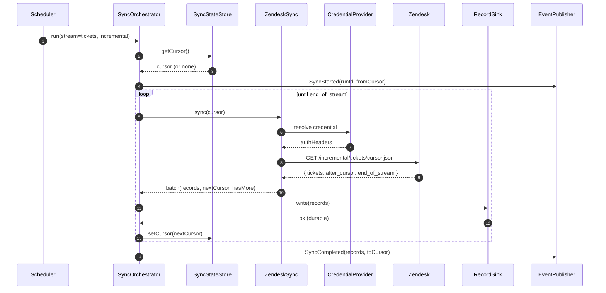
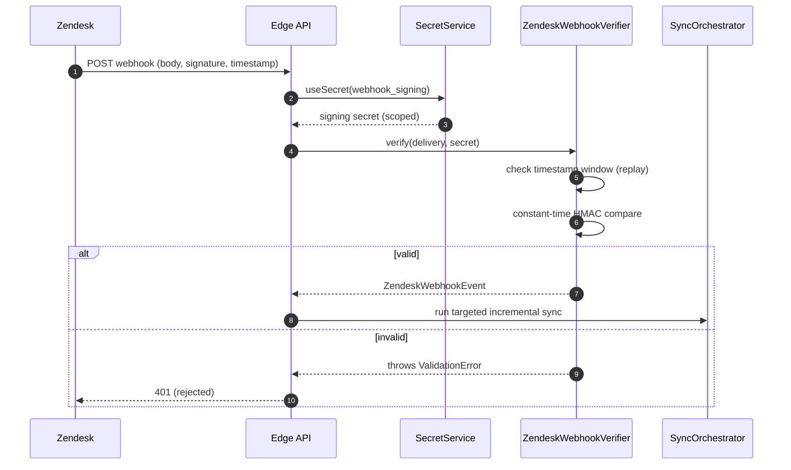
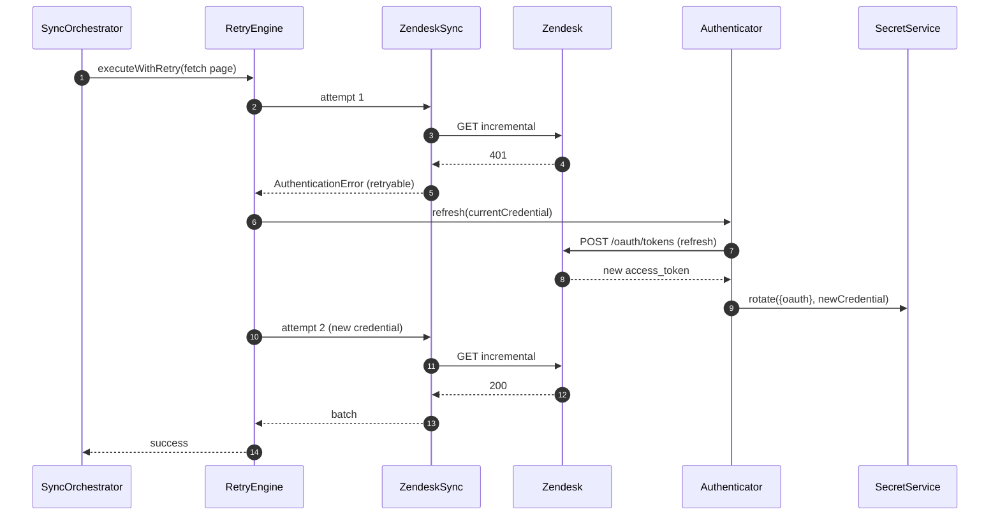

# Sequence Diagrams — F-08 Connector SDK

Rendered with Mermaid. Each diagram shows one critical path end to end.

## 1. OAuth connect (authorization code + PKCE)

```mermaid
sequenceDiagram
    autonumber
    participant U as Tenant Admin
    participant API as Edge API
    participant L as ConnectionLifecycle
    participant A as ZendeskAuthenticator
    participant Z as Zendesk
    participant S as SecretService
    participant K as KMS

    U->>API: Start connect (subdomain)
    API->>A: buildAuthorizeUrl(state, scopes)
    A-->>API: { url, codeVerifier }
    API->>API: persist state + codeVerifier
    API-->>U: redirect to url
    U->>Z: consent
    Z-->>API: redirect ?code&state
    API->>A: exchangeCode(code, codeVerifier)
    A->>Z: POST /oauth/tokens
    Z-->>A: { access_token, refresh_token, expires_in }
    A-->>API: credential
    API->>S: write({oauth}, credential, expiresAt)
    S->>K: generateDataKey(tenantKEK)
    K-->>S: { plaintextDEK, wrappedDEK }
    S->>S: AES-256-GCM encrypt; zero(DEK)
    S-->>API: stored (version 1, ACTIVE)
    API->>L: transition(CONNECT)
    L->>L: PENDING → ACTIVE (row lock)
    L-->>API: ConnectorConnected emitted
```

## 2. Incremental sync with resume



If `Sink.write` throws, the cursor is **not** advanced for that batch; the
orchestrator emits `SyncFailed(atCursor)` and the next run resumes from the last
durable cursor.

## 3. Secret read for use (decrypt then zero)

```mermaid
sequenceDiagram
    autonumber
    participant Caller
    participant S as SecretService
    participant St as SecretStore
    participant Cr as SecretCrypto
    participant K as KMS
    participant Au as SecretAudit

    Caller->>S: useSecret(ref, fn)
    S->>St: getActive(ref)  (RLS: app.tenant_id)
    St-->>S: envelope (ciphertext, wrappedDEK, keyId)
    S->>Cr: decrypt(envelope)
    Cr->>K: decryptDataKey(keyId, wrappedDEK)
    K-->>Cr: plaintextDEK
    Cr->>Cr: AES-256-GCM decrypt; zero(DEK)
    Cr-->>S: plaintext
    S->>Au: DECRYPT_FOR_USE / SUCCESS
    S->>Caller: fn(plaintext)
    S->>S: zero(plaintext) after fn
```

## 4. Webhook delivery verification



## 5. Credential refresh on 401 during sync


