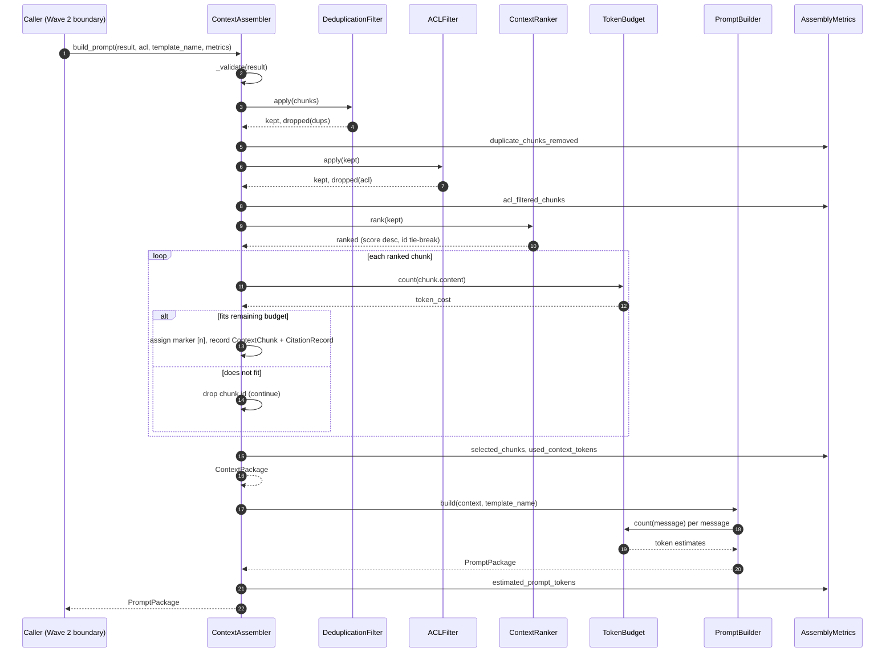
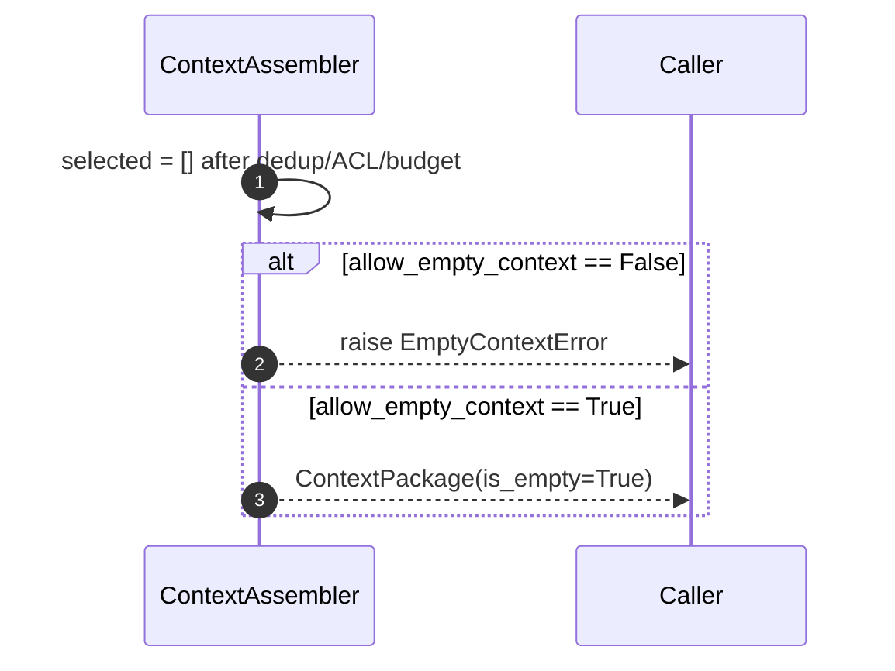
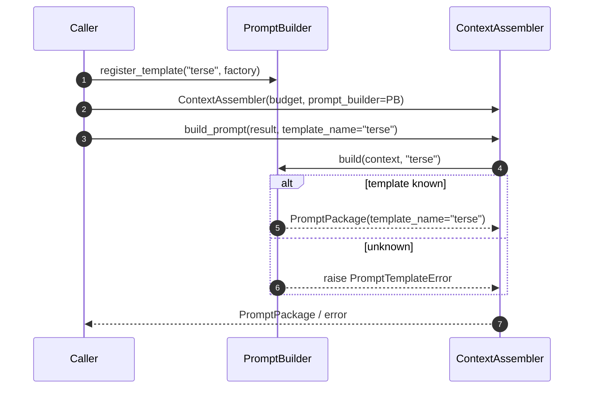

# S1.7 — Context Assembly — Sequence Diagrams

All diagrams use Mermaid. They describe runtime interactions only; no component
performs network or LLM I/O.

## 1. Happy path — `build_prompt` (end to end)



## 2. Token budget enforcement (greedy fill detail)

```mermaid
sequenceDiagram
    autonumber
    participant ASM as ContextAssembler._enforce_budget
    participant BUD as TokenBudget

    ASM->>BUD: available_for_context
    BUD-->>ASM: A
    Note over ASM: used = 0, marker_index = 1
    loop for chunk in ranked
        ASM->>BUD: count(chunk.content)
        BUD-->>ASM: cost
        alt used + cost > A
            Note over ASM: drop chunk id, keep scanning<br/>(smaller later chunks may fit)
        else
            Note over ASM: select; marker = [marker_index]<br/>used += cost; marker_index += 1
        end
    end
    ASM-->>ASM: selected, citations, dropped, used
```

## 3. Empty context decision



## 4. Custom prompt template registration


