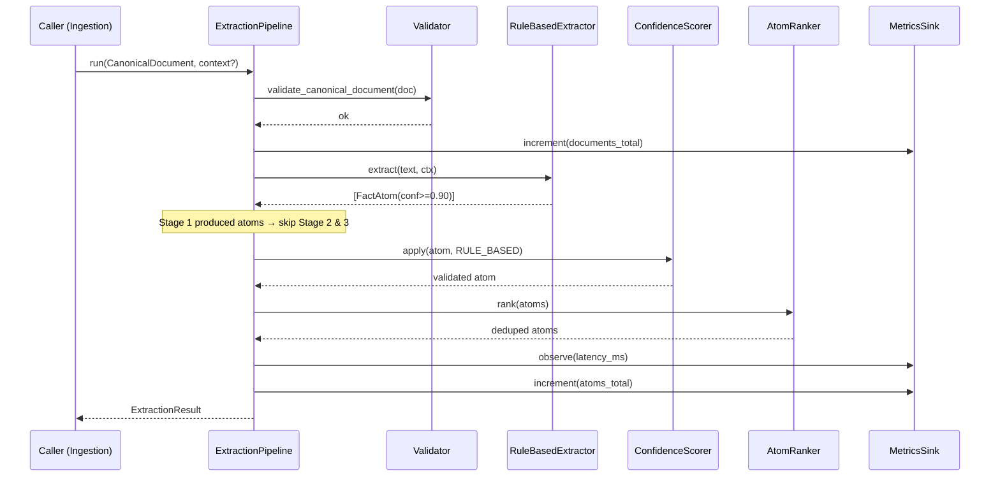
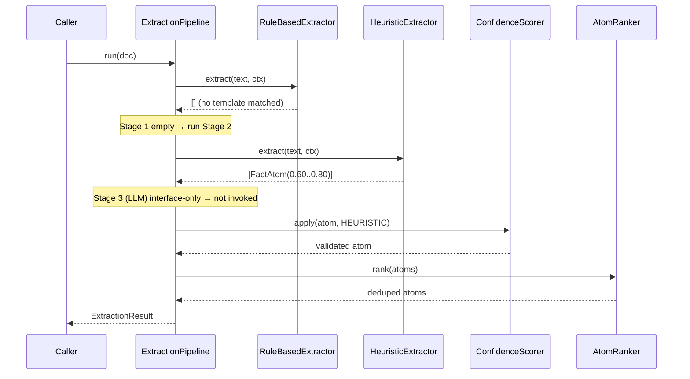
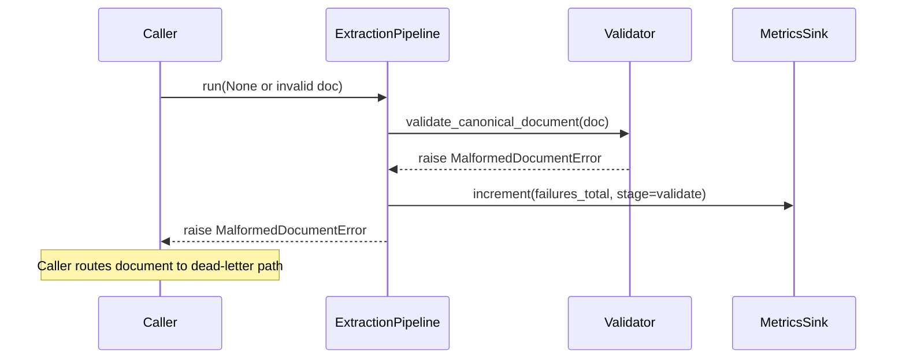
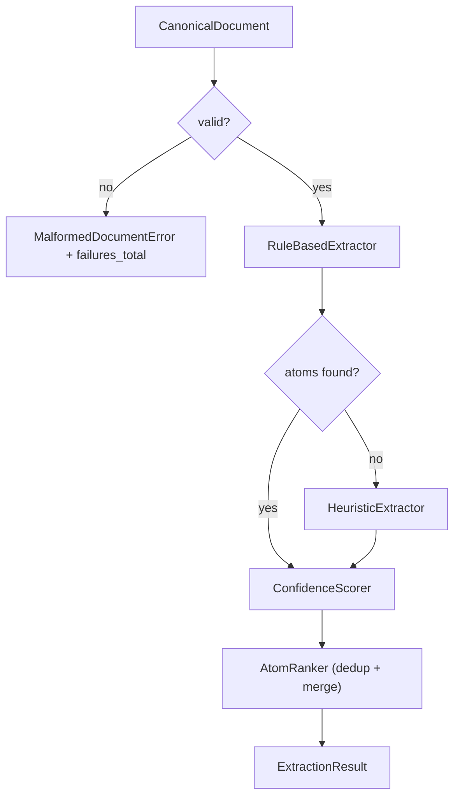

# S1.3 — F-10 Extraction Engine — Sequence Diagrams

All diagrams use Mermaid. Render in any Mermaid-aware viewer.

---

## 1. Happy path — rule-based match



---

## 2. Fallback path — heuristic stage



---

## 3. Malformed document (terminal failure)



---

## 4. Isolated extractor fault (non-terminal)

```mermaid
sequenceDiagram
    participant P as ExtractionPipeline
    participant R as RuleBasedExtractor
    participant H as HeuristicExtractor
    participant M as MetricsSink

    P->>R: extract(text, ctx)
    R-->>P: raise RuntimeError
    P->>M: increment(failures_total, stage=rule_based)
    Note over P: Fault isolated; stage treated as empty
    P->>H: extract(text, ctx)
    H-->>P: [FactAtom...]
    Note over P: Document still produces a valid result
```

---

## 5. Cascade decision flow


