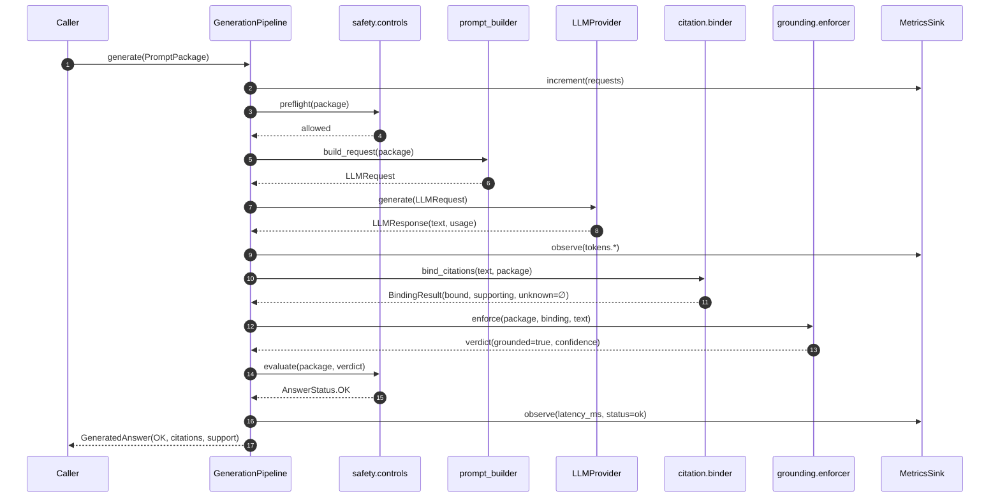
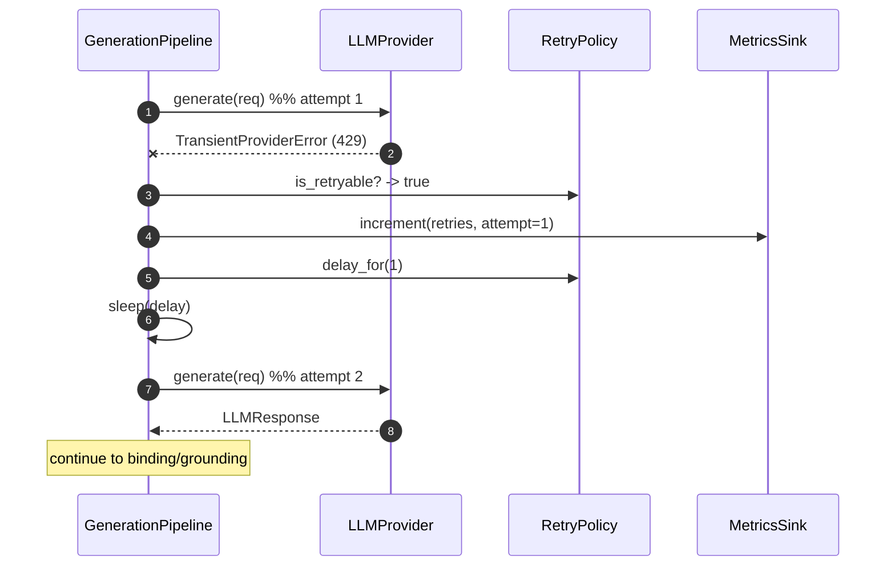
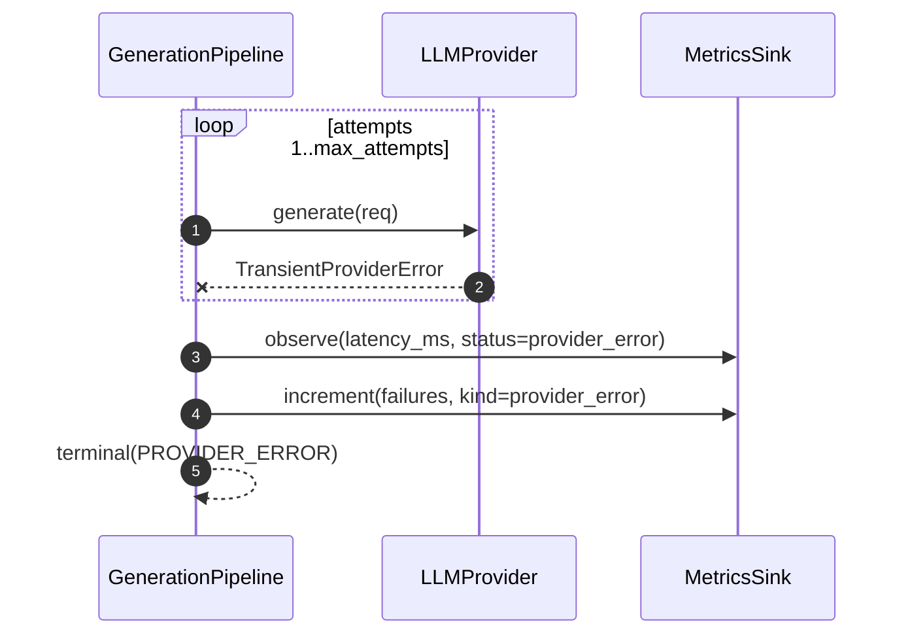
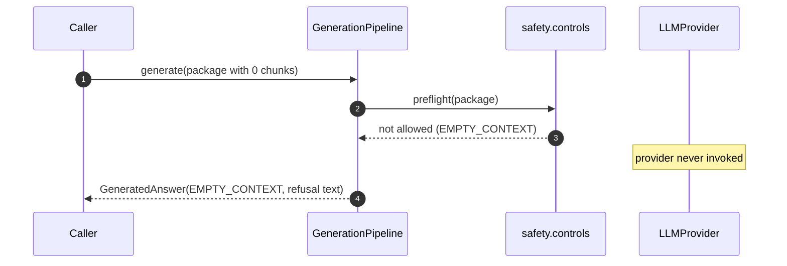
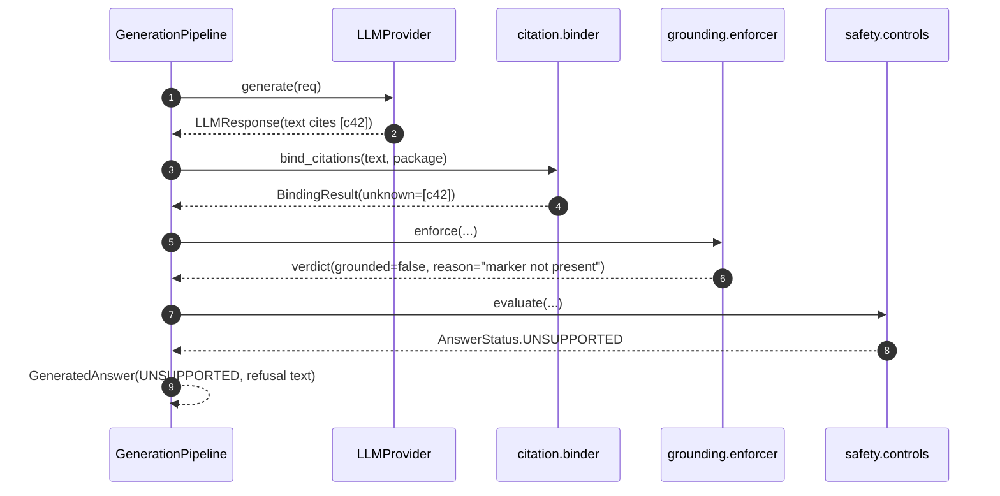

# S1.8 — Sequence Diagrams

All diagrams use Mermaid. Participants map directly to modules in
`generation/`.

## 1. Happy path — grounded answer



## 2. Transient provider failure with retry



## 3. Retry exhausted → provider error



## 4. Pre-flight gate — empty context (no LLM call)



## 5. Grounding rejection — hallucinated citation



## 6. Provider selection / configuration

```mermaid
sequenceDiagram
    autonumber
    participant App as Application
    participant Reg as provider registry
    participant Prov as Concrete Provider

    App->>Reg: create_provider("anthropic", api_key=...)
    Reg-->>App: AnthropicProvider
    App->>Prov: (constructs GenerationPipeline with provider)
    Note over App,Prov: GenerationParams.model selects model per request;<br/>falls back to provider.default_model
```
