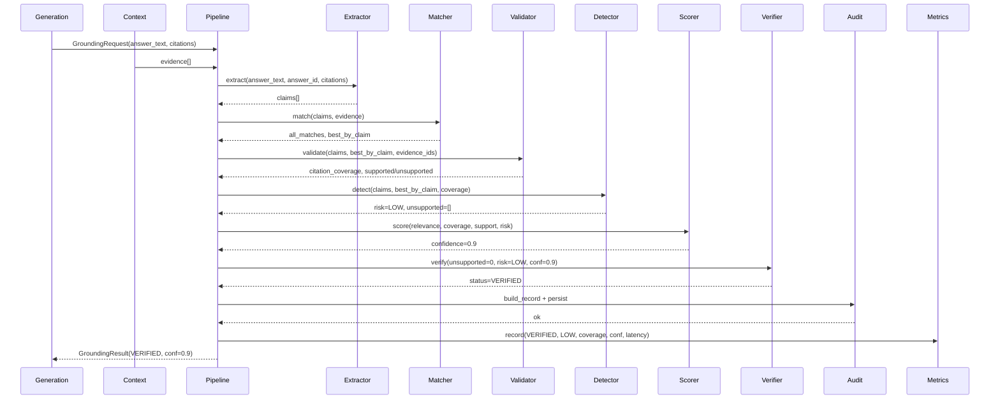
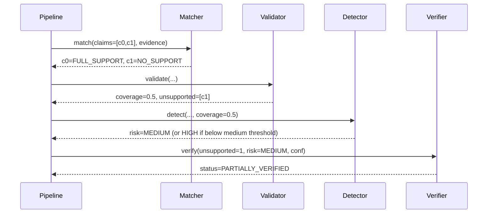
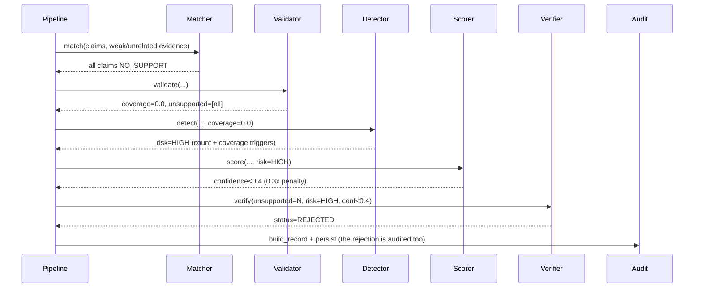
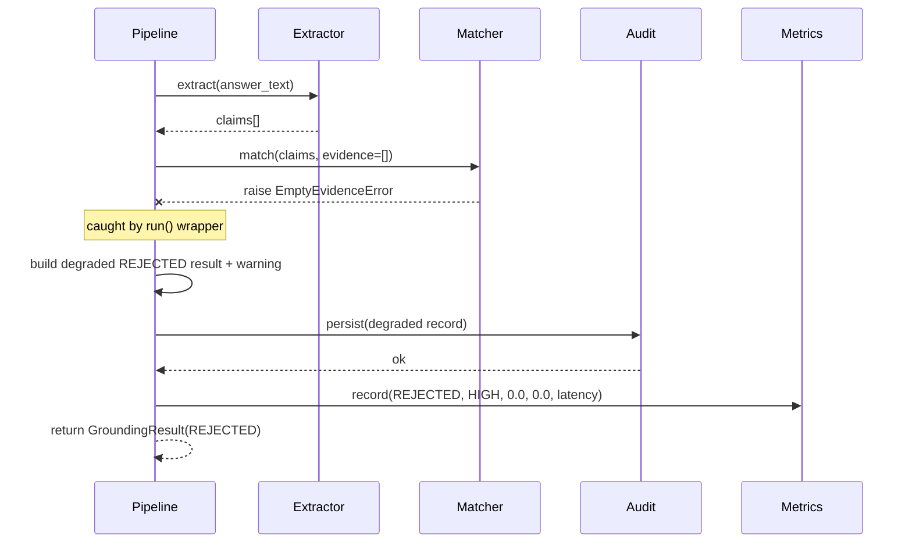
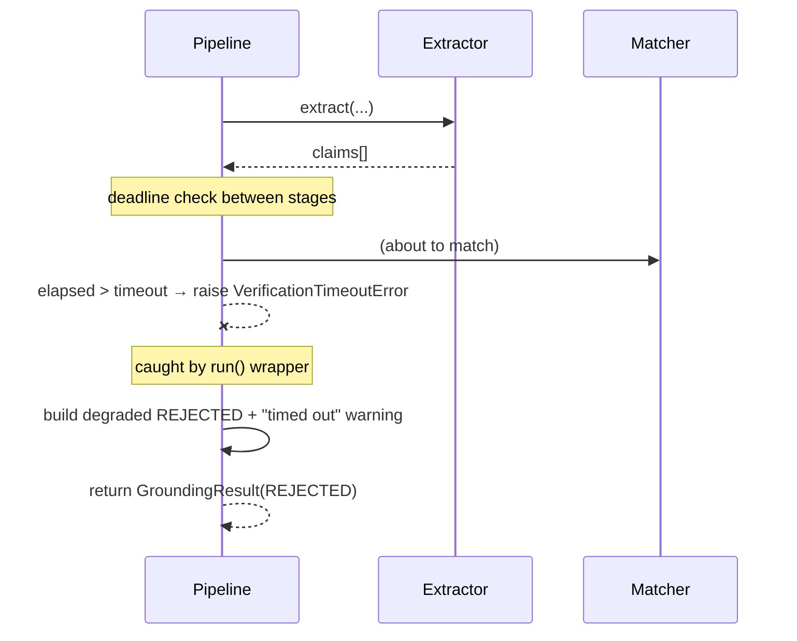
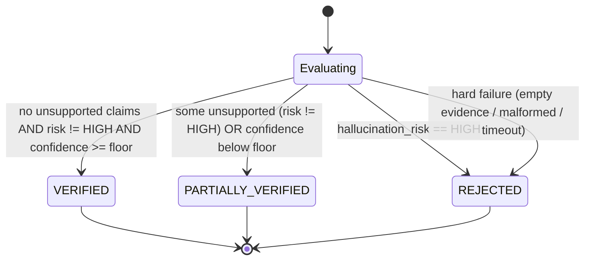
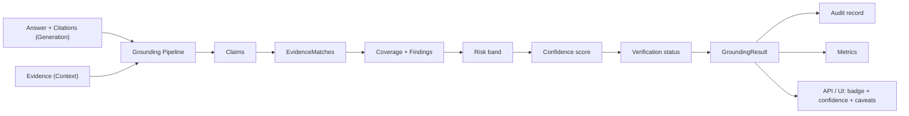

# S1.9 — Grounding & Answer Verification: Sequence Diagrams

> **Audience:** Product Managers, engineers, architects, enterprise customers.
> **Purpose:** show, step by step, how data flows through the grounding layer in the common cases and the failure cases. The diagrams use Mermaid; they also render as readable text for anyone without a Mermaid viewer.

---

## 1. Cast of participants

| Participant | Role |
|---|---|
| **Generation** | Upstream slice; produces the answer text + citations. |
| **Context** | Upstream slice; produces the retrieved evidence. |
| **Pipeline** | `GroundingPipeline` — the orchestrator. |
| **Extractor** | `ClaimExtractor`. |
| **Matcher** | `EvidenceMatcher`. |
| **Validator** | `CitationValidator`. |
| **Detector** | `HallucinationDetector`. |
| **Scorer** | `ConfidenceScorer`. |
| **Verifier** | `AnswerVerifier`. |
| **Audit** | `AuditTrail`. |
| **Metrics** | `GroundingMetrics`. |

---

## 2. Happy path — a fully grounded answer

This is the normal flow that ends in `VERIFIED`.



**Plain-English narration:**
1. The pipeline receives the generated answer and citations, plus the retrieved evidence.
2. The extractor splits the answer into atomic claims.
3. The matcher finds the best supporting evidence for each claim.
4. The validator computes how much of the answer is covered (here, 100%).
5. The detector sees no unsupported claims and full coverage → `LOW` risk.
6. The scorer fuses the signals → high confidence.
7. The verifier rules `VERIFIED`.
8. An audit record is written.
9. Metrics are updated.
10. The result flows back for display with a green badge.

---

## 3. Partially grounded answer

One claim is supported, another is not. Risk is below HIGH, so the verdict is `PARTIALLY_VERIFIED`.



**Narration:** the supported claim is credited, the unsupported one is flagged and listed in `unsupported_claims`. If coverage stays at or above the medium threshold, risk is `MEDIUM` and the answer is shown with a caveat. If coverage falls below the medium threshold, risk escalates to `HIGH` and the next diagram applies.

---

## 4. Hallucinated answer — rejected

Most or all claims are unsupported. Risk is `HIGH`, so the answer is `REJECTED`.



**Narration:** the HIGH-risk veto flows through scoring (the multiplicative penalty crushes confidence) and into the verifier, which rejects. Crucially, **the rejection itself is audited** — enterprises need a record of what was blocked, not just what was shipped.

---

## 5. Failure path — empty evidence (hard degrade)



**Narration:** the matcher raises because there is nothing to ground against. The pipeline's wrapper catches the typed error, builds a safe `REJECTED` result with an explanatory warning, **still audits it**, records metrics, and returns. No exception reaches the caller.

---

## 6. Failure path — audit write fails (soft degrade)

```mermaid
sequenceDiagram
    participant P as Pipeline
    participant Ver as Verifier
    participant A as Audit
    participant Met as Metrics

    Ver-->>P: status=VERIFIED, conf=0.9
    P->>A: build_record + persist
    A--xP: raise AuditWriteError
    note over P: caught; result is NOT discarded
    P->>P: attach "Audit write failed" warning
    P->>Met: record(VERIFIED, ...)
    P-->>P: return GroundingResult(VERIFIED + warning)
```

**Narration:** verification already succeeded. The audit store is momentarily unavailable, but the user's correctly-verified answer is preserved; the failure is captured as a warning and surfaced to ops. This is the one case where a failure is *soft* — losing the answer would be worse than a temporarily missing log line.

---

## 7. Failure path — timeout (hard degrade)



**Narration:** between each stage the pipeline checks the wall-clock budget. If exceeded, it raises a timeout error which the wrapper converts into a safe, audited `REJECTED` result — bounding the latency the user experiences.

---

## 8. State-transition view of verification status

How an answer moves to its final status, regardless of which path produced the signals:



**Narration:**
- **VERIFIED** requires three things at once: every claim supported, risk not HIGH, and confidence at or above the policy floor.
- **PARTIALLY_VERIFIED** is the "yellow" middle: either some claims are unsupported (but risk is not HIGH), or all claims are supported but confidence is just below the floor.
- **REJECTED** is reached either by a HIGH-risk verdict or by any hard failure, which always maps to a safe rejection.

---

## 9. One-glance data-flow summary



This is the whole slice on one line: *two upstream inputs in, one verified-and-audited result out, feeding the UI's trust indicators.*
