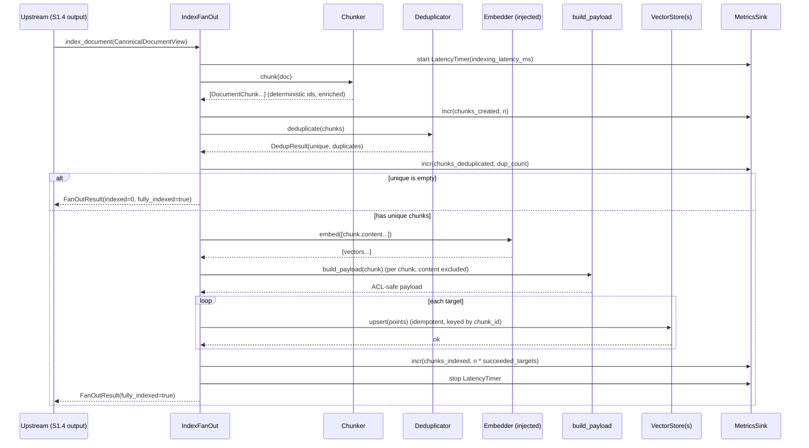
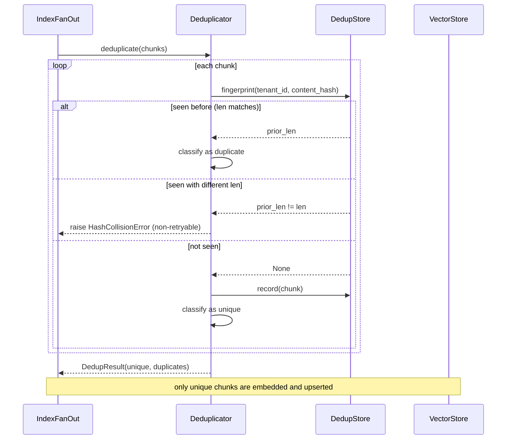
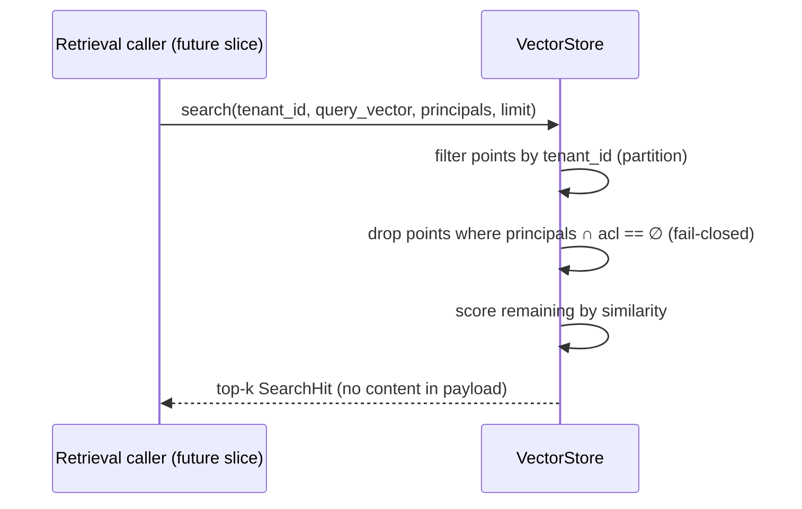

# S1.5 — Index Fan-Out — Sequence Diagrams

Sequence diagrams for the principal S1.5 flows. Diagrams use Mermaid; the ASCII
fallback beneath each is authoritative if Mermaid does not render.

---

## 1. Happy path — index a canonical document



ASCII fallback:

```
Caller -> IndexFanOut.index_document(doc)
  FanOut -> start latency timer
  FanOut -> Chunker.chunk(doc)            => chunks (deterministic ids)
  FanOut -> metrics.incr(chunks_created)
  FanOut -> Deduplicator.deduplicate()    => (unique, duplicates)
  FanOut -> metrics.incr(chunks_deduplicated)
  if unique empty: return indexed=0, fully_indexed=true
  FanOut -> Embedder.embed(contents)      => vectors
  FanOut -> build_payload(chunk)          => payload WITHOUT content
  for each target: VectorStore.upsert(points)   (idempotent)
  FanOut -> metrics.incr(chunks_indexed)
  FanOut -> stop latency timer
  return FanOutResult(fully_indexed=true)
```

---

## 2. Deduplication suppresses re-indexing



ASCII fallback:

```
Deduplicator.deduplicate(chunks):
  for chunk:
    prior = DedupStore.fingerprint(tenant_id, hash)
    if prior is None        -> record + mark UNIQUE
    elif prior == len       -> mark DUPLICATE (suppressed)
    else (prior != len)     -> raise HashCollisionError
  return (unique, duplicates)
Only UNIQUE chunks continue to embed + upsert.
```

---

## 3. Partial index failure + per-target retry

```mermaid
sequenceDiagram
    participant FO as IndexFanOut
    participant TA as Target A (healthy)
    participant TB as Target B (flaky/dead)
    participant RP as RetryPolicy

    FO->>TA: upsert(points)
    TA-->>FO: ok  (A recorded)
    FO->>TB: upsert(points)
    TB-->>FO: VectorStoreUnavailable (retryable)
    FO->>RP: delay_for(attempt=1)
    RP-->>FO: backoff
    FO->>TB: upsert(points)  (retry)
    alt eventually succeeds
        TB-->>FO: ok
        FO-->>FO: succeeded = [A, B]
    else exhausts attempts OR VectorStoreRejected (non-retryable)
        TB-->>FO: error
        FO-->>FO: failures = {B: error}; A stays committed
        FO-->>Caller: raise PartialIndexError(failures={B})
    end
    Note over FO,TA: A is NOT rolled back; idempotent upsert makes a later<br/>retry of B safe with no duplication in A
```

ASCII fallback:

```
dispatch(points):
  for each target:
    upsert_with_retry(target):
      attempt=1..max:
        try upsert; return on success
        on VectorStoreError:
          if not retryable or attempt==max: raise
          sleep(RetryPolicy.delay_for(attempt)); continue
  succeeded += target on success
  failures[target] = err on failure   (other targets untouched)
if failures: raise PartialIndexError(failures)   # A remains committed
```

---

## 4. Nightly reconciliation + repair

```mermaid
sequenceDiagram
    participant SCH as Nightly scheduler
    participant RC as Reconciler
    participant SRC as ExpectedChunkSource
    participant CH as Chunker
    participant VS as VectorStore(s)
    participant FO as IndexFanOut
    participant MX as MetricsSink

    SCH->>RC: run(repair=true)
    RC->>SRC: documents()
    SRC-->>RC: [CanonicalDocumentView...]
    loop each document
        RC->>CH: chunk(doc)
        CH-->>RC: expected_chunks (by deterministic id)
        loop each target
            RC->>VS: fetch_ids(tenant_id, document_id)
            alt fetch fails
                VS-->>RC: ReconciliationError
                RC->>MX: incr(reconciliation_failures)
                RC->>RC: record finding(error); continue
            else fetch ok
                VS-->>RC: actual_ids
                RC->>RC: missing = expected - actual
                RC->>SRC: expected_hash(id) for present ids
                RC->>RC: stale = present ids w/ hash mismatch
                RC->>RC: orphan = actual - expected
                opt orphans + repair
                    RC->>VS: delete(tenant_id, orphans)
                end
                RC->>RC: record finding
            end
        end
        opt missing or stale + repair
            RC->>FO: reindex_chunks(tenant_id, expected_chunks)  (BYPASS dedup)
            FO->>VS: upsert(points)  (idempotent)
            FO-->>RC: (succeeded, failures)
            RC->>RC: chunks_reindexed += n
        end
    end
    RC-->>SCH: ReconciliationReport(summary, findings)
```

ASCII fallback:

```
Reconciler.run(repair):
  for doc in source.documents():
    expected = Chunker.chunk(doc)            # deterministic ids
    for target:
      try actual = target.fetch_ids(tenant, doc)
      except: incr(reconciliation_failures); record(error); continue
      missing = expected_ids - actual
      stale   = present ids where source.expected_hash(id) != expected hash
      orphan  = actual - expected_ids
      if repair and orphan: target.delete(orphan)
      record finding(missing, stale, orphan)
    if repair and (missing or stale):
      fanout.reindex_chunks(tenant, expected)   # BYPASS dedup, idempotent
      chunks_reindexed += len(expected)
  return ReconciliationReport
```

---

## 5. Read-time ACL enforcement (search)



ASCII fallback:

```
search(tenant_id, qv, principals, limit):
  candidates = points where payload.tenant_id == tenant_id
  visible    = candidates where principals ∩ acl != empty   (empty acl -> hidden)
  rank visible by similarity; return top-k (payload has no content)
```
