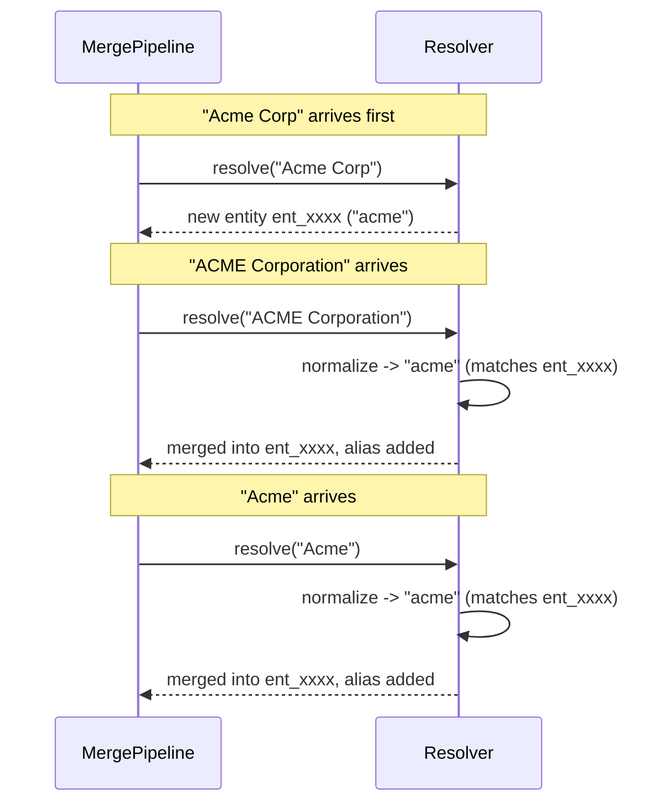
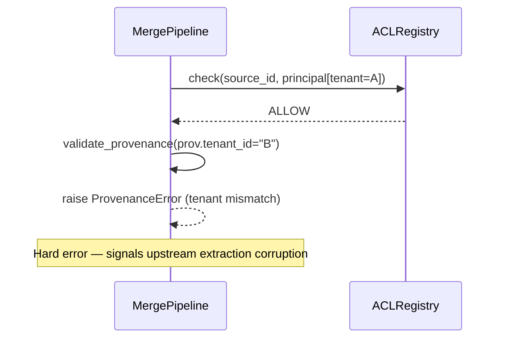

# S1.4 — Sequence Diagrams

## 1. Happy Path: Extraction → Resolution → Provenance → Canonical Entity

```mermaid
sequenceDiagram
    participant U as Upstream (S1.2/S1.3)
    participant P as MergePipeline
    participant A as ACLRegistry
    participant R as Resolver
    participant E as CanonicalEntity
    participant M as Metrics

    U->>P: PipelineInput(atom, provenance)
    P->>M: record_processed()
    P->>A: check(source_id, principal)
    A-->>P: ALLOW
    P->>P: validate_provenance(item)
    P->>R: resolve(atom)
    R->>R: normalize_text(name)
    R->>R: exact / alias / normalized lookup
    alt no match
        R->>E: mint new CanonicalEntity(canonical_id)
        R-->>P: outcome(created=true, merged=false)
    else match found
        R->>E: add_alias(name); confidence = min(...)
        R-->>P: outcome(created=false, merged=true)
        P->>M: record_merged()
    end
    P->>E: attach ProvenanceRecord
    P->>M: record_provenance()
    P-->>U: PipelineResult(entities, provenance, rejected, metrics)
```

## 2. Duplicate Merge Flow



## 3. ACL Rejection Flow

```mermaid
sequenceDiagram
    participant P as MergePipeline
    participant A as ACLRegistry
    participant R as Resolver
    participant M as Metrics

    P->>M: record_processed()
    P->>A: check(source_id="src-deny", principal)
    A-->>P: DENY
    P->>M: record_acl_rejection()
    P-->>P: append atom_id to rejected; return None
    Note over R: Resolver is never invoked — no merge, no provenance
```

## 4. Cross-Tenant Provenance Rejection


