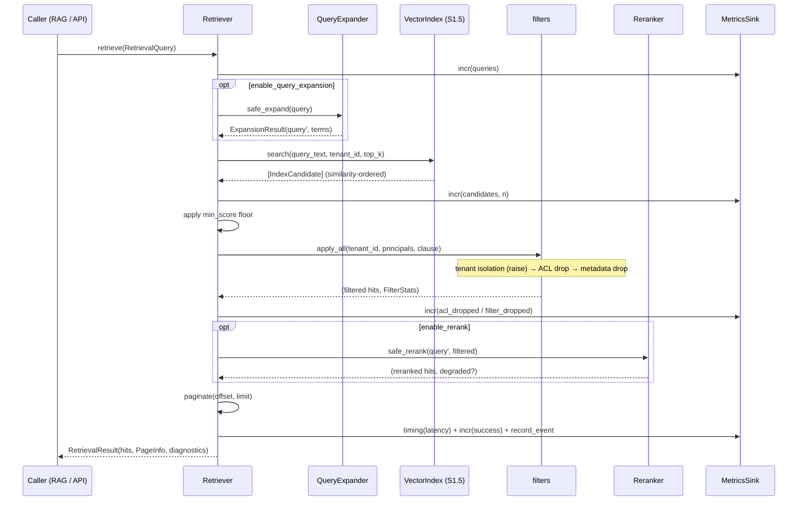
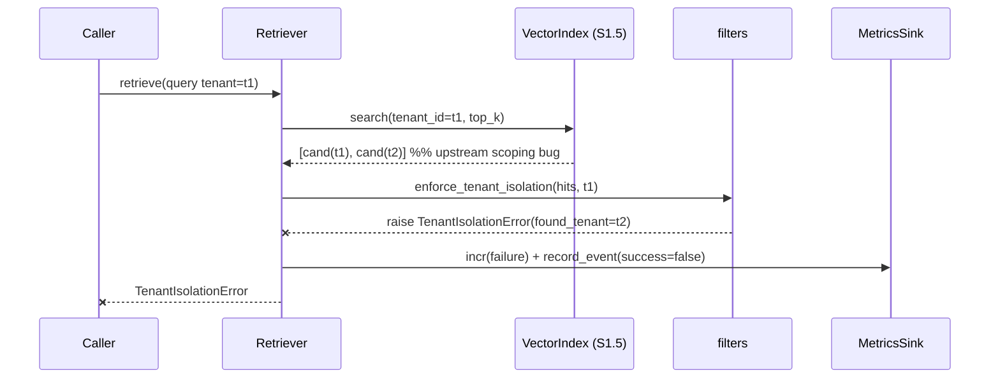
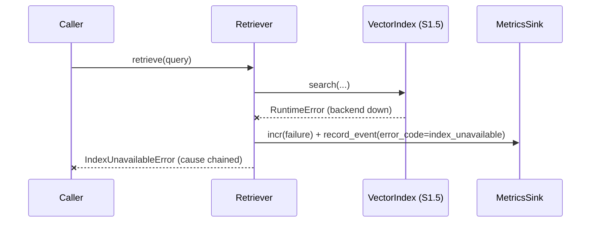
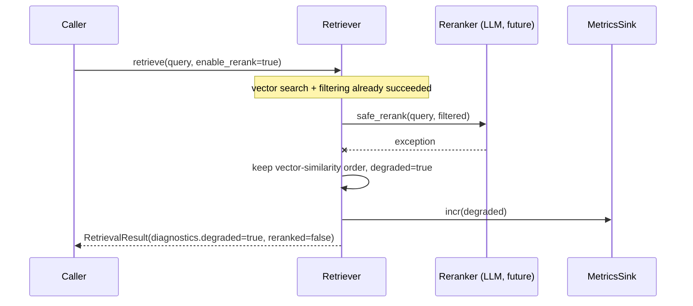
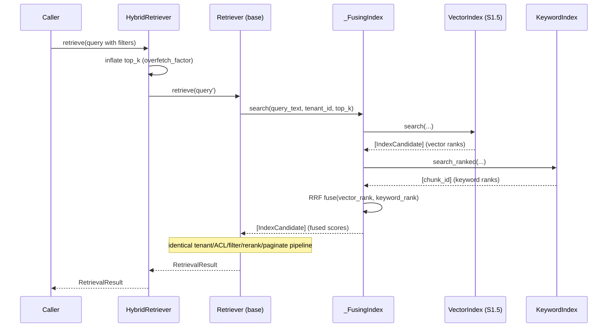

# S1.6 — Retrieval Layer · Sequence Diagrams

All diagrams use Mermaid and reflect the implementation in `backend/retrieval/`.

---

## 1. Standard semantic retrieval (happy path)

---

## 2. Tenant isolation breach (fail-closed)

The breach is never swallowed: a foreign-tenant record signals an upstream bug
and must surface loudly.

---

## 3. Index backend failure (wrapped + degraded metric)

---

## 4. Non-fatal degradation (reranker fails → fall back to vector order)

Query expansion follows the identical degrade-don't-fail pattern via
`safe_expand`.

---

## 5. Hybrid retrieval with score fusion

Because `_FusingIndex` satisfies the `VectorIndex` contract, hybrid retrieval
reuses every downstream guarantee of the base retriever.
