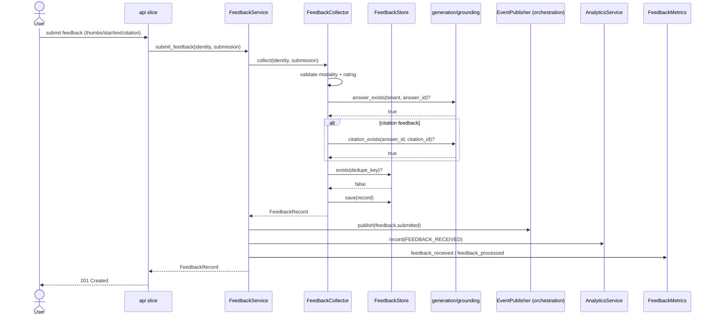
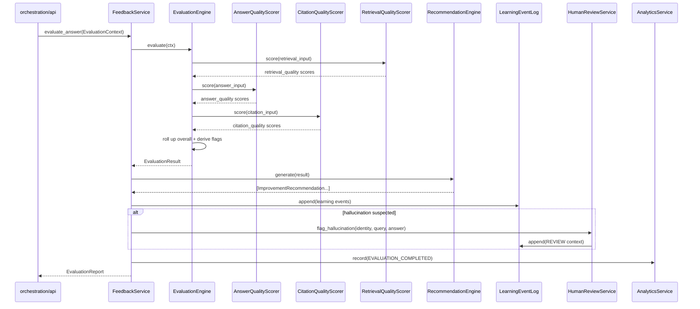
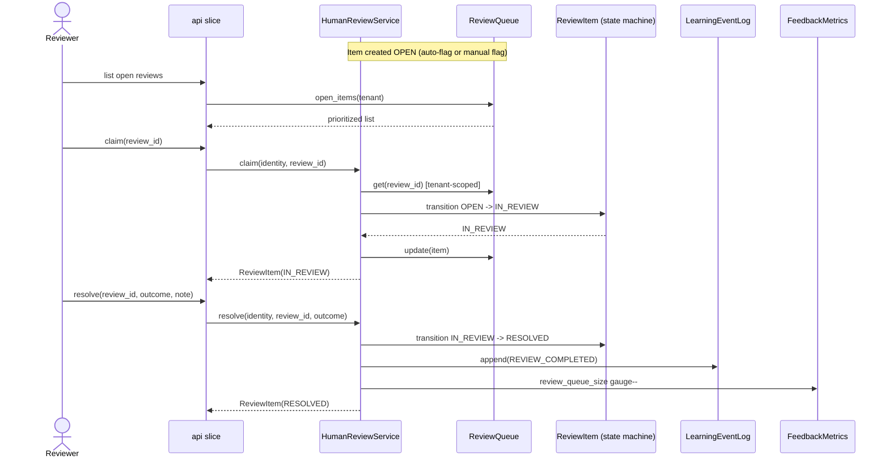
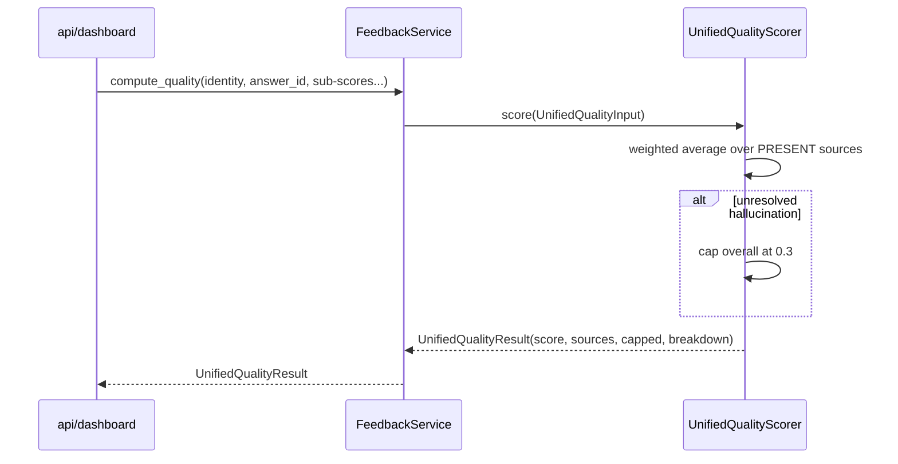
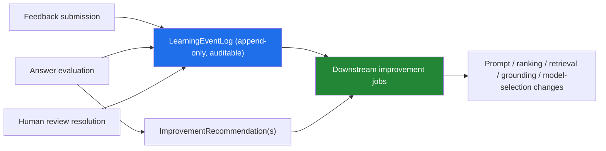

# PMOS Slice S2.4 — Sequence Diagrams

**Version:** 2.4.0
**Audience:** Engineers, solution architects, product managers

These diagrams trace the principal runtime flows through the feedback,
evaluation, and continuous-learning slice. They use Mermaid sequence syntax and
also include plain-text fallbacks for environments that do not render Mermaid.

The four flows documented:

1. Feedback submission
2. Answer evaluation (with auto-flag on hallucination)
3. Human review lifecycle
4. Unified quality computation

A fifth section shows how these flows feed the **continuous-learning** data
asset.

---

## 1. Feedback Submission

A user reacts to an answer. The submission is validated, deduplicated,
persisted, published as a workflow event, and folded into analytics.

**Plain-text fallback**

1. User submits feedback via the API.
2. `FeedbackService.submit_feedback` delegates to `FeedbackCollector.collect`.
3. The collector validates the rating/modality, then confirms the answer (and
   citation, if applicable) exist via injected callables backed by
   `generation`/`grounding`.
4. The collector checks the `dedupe_key` against the store; if new, it saves.
5. The service publishes a `feedback.submitted` workflow event, records a
   `FEEDBACK_RECEIVED` analytics event, and increments metrics.
6. The persisted record is returned.

**Failure branches:** invalid rating → `InvalidRatingError`; unknown answer →
`MissingAnswerError`; unknown citation → `MissingCitationError`; duplicate →
`DuplicateFeedbackError` (unless `allow_update=True`). All occur before
publish/analytics, so a rejected submission emits no downstream events.

---

## 2. Answer Evaluation (with auto-flag on hallucination)

The system evaluates an answer across all pipeline stages, derives learning
events and recommendations, and auto-opens a review when a hallucination is
suspected.

**Plain-text fallback**

1. A caller invokes `evaluate_answer` with an `EvaluationContext`.
2. `EvaluationEngine` runs each available scorer. Each scorer call is wrapped by
   `_safe()`; a crash degrades to a zero-weight stage rather than aborting.
3. The engine rolls up an overall score and derives the three failure flags
   (hallucination suspected, citation failure, retrieval failure) from stage
   scores and the grounding ratio against fixed thresholds.
4. The service generates improvement recommendations from the result and appends
   learning events (poor answer / high quality / failures) to the append-only
   log.
5. If a hallucination is suspected, the service auto-flags the answer for human
   review at elevated priority.
6. An `EVALUATION_COMPLETED` analytics event is recorded, and an
   `EvaluationReport` (result + learning events + recommendations) is returned.

**Failure branch:** if the context yields no scorable stage at all, the engine
raises `EvaluationError` and no report is produced.

---

## 3. Human Review Lifecycle

A flagged answer moves through the review state machine; resolution emits a
durable learning signal.

**Plain-text fallback**

1. A review item exists in `OPEN` (created by auto-flag during evaluation or by
   an explicit human flag).
2. A reviewer lists open items; the queue returns them prioritized (high-severity
   reasons such as hallucination/policy first, then by age), tenant-scoped.
3. The reviewer `claim`s an item; the state machine moves `OPEN → IN_REVIEW`.
   Cross-tenant claims are rejected; illegal transitions raise
   `InvalidReviewTransitionError`.
4. The reviewer `resolve`s with an outcome (confirmed / rejected / corrected /
   no action); the item moves to `RESOLVED`, a `REVIEW_COMPLETED` learning event
   is appended, and the queue-size gauge is decremented.
5. Alternatively, `dismiss` moves an item to `DISMISSED` from `OPEN` or
   `IN_REVIEW`.

---

## 4. Unified Quality Computation

A single overall quality score is derived from whichever signals are present,
with a hard safety cap on unresolved hallucinations.

**Plain-text fallback**

1. A caller requests a unified score, optionally supplying retrieval, citation,
   feedback, and review sub-scores.
2. `UnifiedQualityScorer` averages only the sources that are present, using
   per-source weights (feedback 1.2, citation 1.2, review 1.0, retrieval 0.8).
3. If an unresolved hallucination is flagged, the score is capped at 0.3 — a
   fabricated-but-fluent answer can never report as high quality.
4. The result reports the score, which sources contributed, whether the cap was
   applied, and the per-source breakdown. With no sources present, the score is
   `None` (not zero), signalling "insufficient data" rather than "bad".

---

## 5. How the Flows Feed Continuous Learning

The flows above are deliberately wired so that signal accumulates without any
model being retrained inside the slice:

- **Feedback submission**, **evaluation**, and **review resolution** all append
  to the same append-only, tenant-scoped `LearningEventLog`.
- **Evaluation** additionally emits routable `ImprovementRecommendation`s naming
  the subsystem to change.
- Downstream jobs (outside S2.4) consume the log and recommendations to drive
  prompt, ranking, retrieval, grounding, and model-selection improvements —
  each evaluable per tenant/workspace because every signal is scoped and
  auditable.

This is the loop that lets PMOS improve with usage: S2.4 manufactures the
evidence; other slices act on it.
