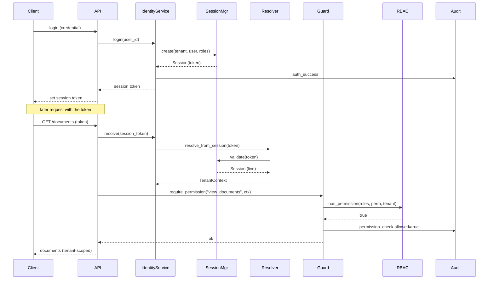
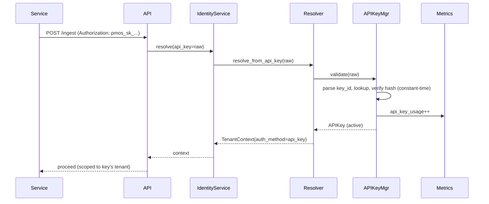
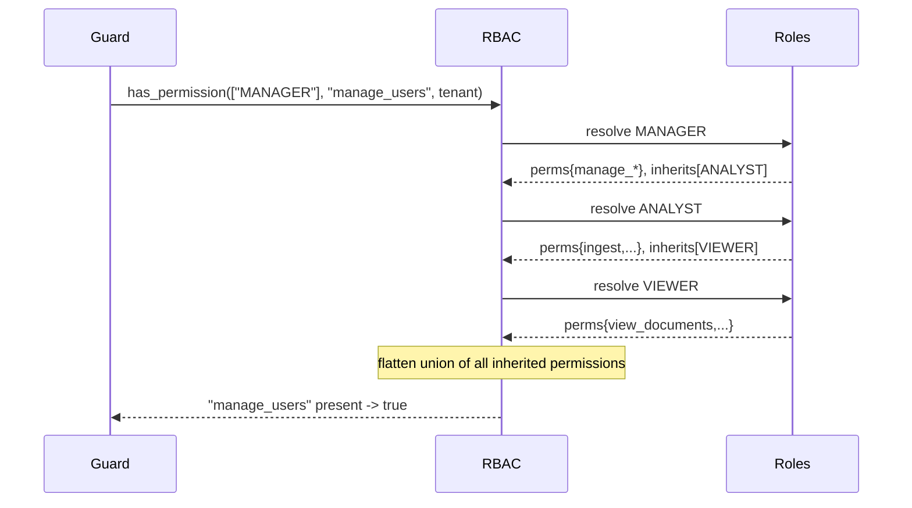
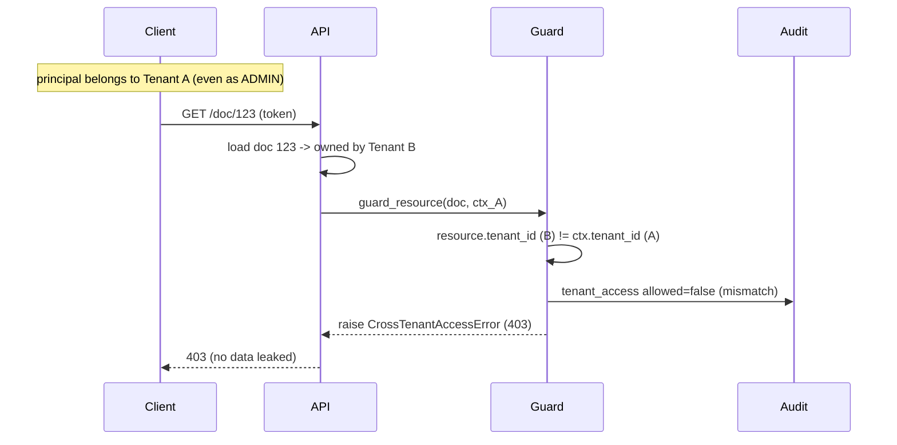
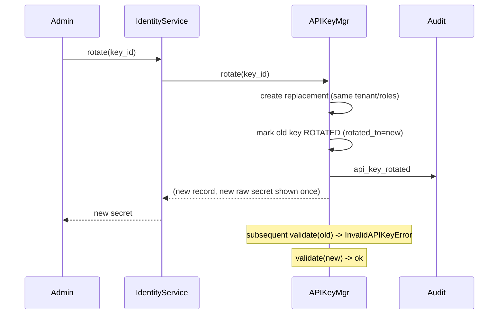
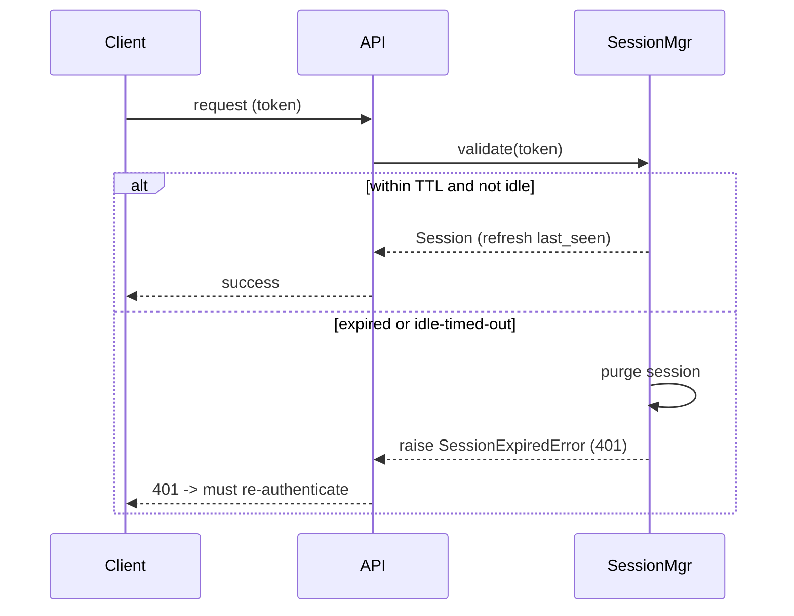
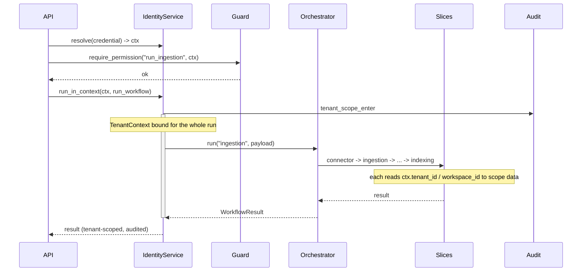

# S2.3 — Identity & Access Control: Sequence Diagrams

These Mermaid diagrams show how identity, tenancy, and access control behave over
time across the key flows and failure modes. Each has a plain-language
walkthrough so a Product Manager can narrate it to engineers, security teams,
enterprise customers, investors, or solution architects.

Recurring participants:

- **Client** — a browser/app (sessions) or a service (API keys)
- **API** — the `backend/api` slice
- **IdentityService** — the facade for this slice
- **Resolver / Guard / RBAC / SessionMgr / APIKeyMgr / Audit / Metrics** — internals
- **Orchestrator** — the `backend/orchestration` slice (S2.2)

---

## 1. Interactive login → authenticated request

**Walkthrough:** The user authenticates once and receives a session token. On
each later request the API resolves that token into a tenant context, the guard
confirms the user's roles grant the needed permission, and the audit log records
the check. The documents returned are scoped to the user's tenant.

---

## 2. Machine request via API key

**Walkthrough:** A service presents its API key. The manager locates the record
by the id embedded in the token (constant-time hash check), counts the usage, and
returns a tenant context. The key's own roles determine what it may do — a
least-privilege ingestion key can ingest but not manage users.

---

## 3. RBAC evaluation with inheritance

**Walkthrough:** A permission check walks the role's inheritance chain, unions all
permissions, and answers yes/no. MANAGER inherits ANALYST inherits VIEWER, so a
manager automatically has every lower capability without it being re-listed.

---

## 4. Tenant isolation block (cross-tenant access denied)

**Walkthrough:** A valid, even fully-privileged, user from Tenant A requests a
document owned by Tenant B. The guard compares the resource's tenant to the
caller's and refuses — wildcard/ADMIN does not cross tenants. The denial is
audited and no data leaks.

---

## 5. API key lifecycle: rotation

**Walkthrough:** Rotation issues a new key inheriting the old one's tenant and
roles, marks the old one as superseded (kept for audit, no longer usable), and
returns the new secret once. Integrations can be migrated without downtime, then
the old key stops working.

---

## 6. Session expiry

**Walkthrough:** Each request re-validates the session against both an absolute
lifetime and an idle timeout. An expired or idle session is purged and the client
is told to log in again — stale tokens can't be reused.

---

## 7. Orchestration workflow inside a tenant context

**Walkthrough:** Before running a workflow the API checks the caller may run it,
then runs it *inside* the tenant context. Every orchestration step (from S2.2)
executes with that context bound, so each slice scopes its data to the right
tenant and workspace. Entry into the scope is audited, tying the whole job to a
tenant and principal.

---

## Reading these as a Product Manager

Each diagram answers a stakeholder's core question:

- **Engineers:** the exact call order and where the context is created, bound, and
  checked.
- **Security teams:** that authentication, authorization, and isolation are
  distinct, enforced, fail-closed, and audited — and that wildcard never crosses
  tenants.
- **Enterprise customers:** that their data is isolated by design, their admins
  can rotate keys and force logout, and every access is logged.
- **Investors / architects:** that the platform is genuinely multi-tenant SaaS —
  one deployment safely serving many customers — with pluggable enterprise auth
  ready to slot in.
