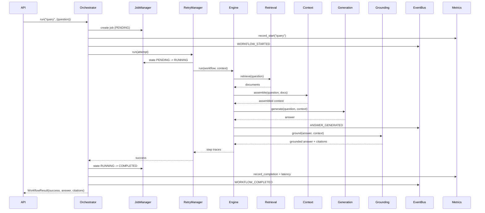
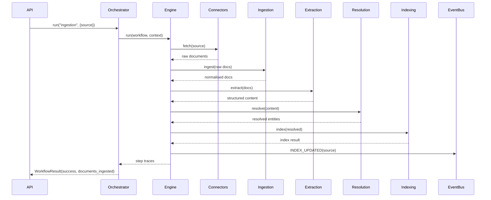
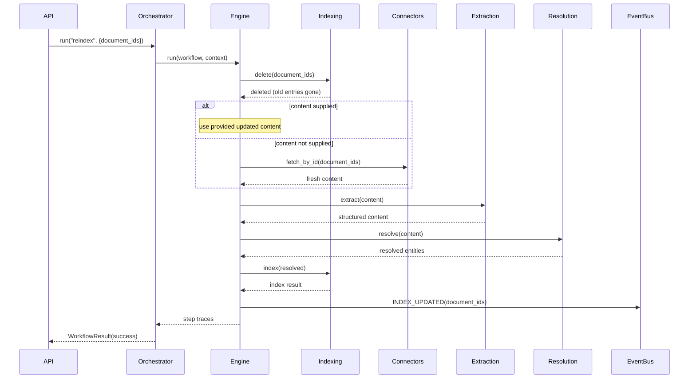
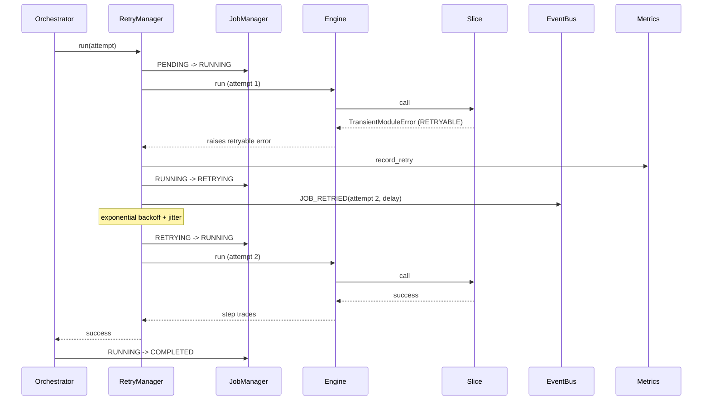
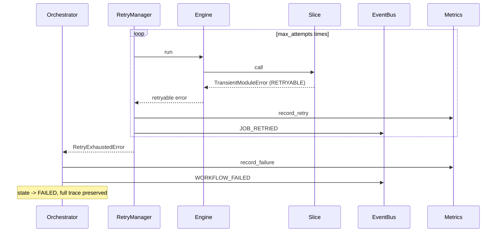
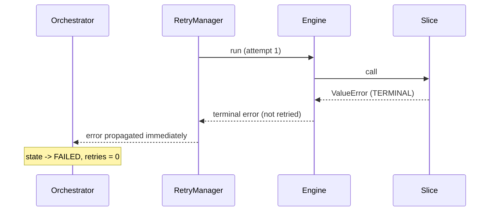
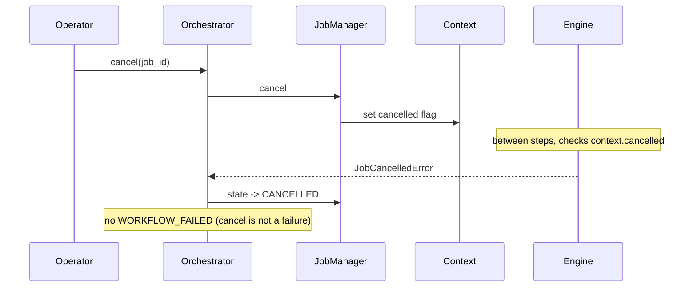

# S2.2 — Orchestration Engine: Sequence Diagrams

These diagrams show how the orchestration layer drives each workflow and each
significant failure mode over time. They are written in Mermaid (renders in
GitHub, most IDEs, and docs tooling) with a plain-language walkthrough beneath
each so a Product Manager can narrate them without reading the code.

The recurring participants:

- **API** — the caller (backend/api slice or operator tooling)
- **Orchestrator** — central engine (`orchestrator.py`)
- **Registry / JobManager / StateMachine / RetryManager / Engine / EventBus /
  Metrics** — orchestration internals
- **Slices** — the previously-built capability modules

---

## 1. Query workflow — happy path

**Walkthrough:** A question comes in. The orchestrator opens a job, announces
the start, and runs the steps in order. Retrieval finds source material, context
assembly packs it for the model, generation writes the answer, grounding checks
it and attaches citations. Each handoff stores its output in the shared context.
On success the job is marked completed and a clean result with the answer and
citations goes back to the caller.

---

## 2. Ingestion workflow — happy path

**Walkthrough:** New content enters PMOS. Documents are pulled from the source
connector, normalised, parsed into structured content, de-duplicated and
entity-resolved, then written to the index. The `INDEX_UPDATED` event lets
caches and dashboards refresh. The result reports how many documents were
ingested.

---

## 3. Reindex workflow — happy path

**Walkthrough:** A known document changed. The stale index entries are deleted
**first**, guaranteeing retrieval never sees two versions at once. The fresh
content is then reprocessed and re-indexed. `INDEX_UPDATED` signals the change.

---

## 4. Retry then success

**Walkthrough:** A slice hits a transient error. Because it's classified
retryable, the job moves to RETRYING, the retry is counted and announced, the
manager waits (backoff with jitter), then re-runs. The second attempt succeeds
and the job completes. The user never sees the hiccup.

---

## 5. Retry exhaustion → failure

**Walkthrough:** The transient error never clears. After the configured number
of attempts the retry manager gives up with `RetryExhaustedError`. The workflow
is marked FAILED, the failure is counted, `WORKFLOW_FAILED` is published, and the
result carries the last underlying error and a complete step trace for
diagnosis.

---

## 6. Terminal failure (no retries)

**Walkthrough:** Some failures cannot be fixed by retrying — bad input, a logic
error, an auth failure. These are classified terminal, so the retry manager does
not loop. The workflow fails immediately with zero wasted retries.

---

## 7. Cancellation

**Walkthrough:** Cancellation is cooperative. The flag is set on the running
job's context; the engine checks it at the next step boundary and stops cleanly.
The job ends in CANCELLED — distinct from FAILED — so it's not counted as an
error.

---

## Reading these as a Product Manager

Each diagram answers one stakeholder question:

- **Engineers:** which method is called, in what order, with what data.
- **Architects:** where the boundaries are — the orchestrator never does domain
  work, it only sequences slices.
- **Enterprise customers:** that failures, retries, and cancellations are
  explicit, observable, and safe for their data (note the delete-before-write
  ordering in reindex).
- **Investors:** that reliability is a designed-in platform property — one
  engine makes every current and future workflow resilient and measurable.
